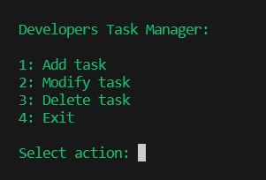

# Developers' Task Manager

The Developers' Task Manager is a Python-based application designed to help developers organize and manage their tasks efficiently. It provides a simple interface to add, modify, and delete tasks, ensuring that developers can focus on what they do best: coding.

## Overview
This project, Developers' Task Manager, is a console-based application designed to help software developers manage their tasks efficiently. It offers a simple yet powerful interface to add, modify, delete, and view tasks, making it easier for developers to keep track of their work progress. Built with Python, the application emphasizes ease of use, flexibility, and productivity.

The key features of Developers' Task Manager include:

Task Addition: Users can add new tasks with descriptions, automatically assigning them a unique ID and timestamp.
Task Modification: Offers the ability to modify the description of existing tasks, ensuring that task information is always up to date.
Task Deletion: Users can remove tasks that are no longer relevant, keeping the task list clean and focused.
Task Viewing: Provides a comprehensive view of all tasks, along with their details, helping users quickly find the information they need.
Designed for developers by developers, this task manager stands out by its simplicity and direct approach to task management. Whether you're working on a large project or juggling multiple small projects, Developers' Task Manager is your companion in maintaining productivity and organization

## Features
   Developers' Task Manager provides a streamlined task management experience through its set of features designed to enhance productivity and organization. Here are the core functionalities:

- Simple Task Creation: Add tasks with ease, providing only the essential details such as the task description. Each task is automatically timestamped and assigned a unique identifier upon creation.

- Effortless Task Modification: Update the details of any task as requirements change. This feature ensures that task descriptions are always accurate and reflect the current state of work.

- Quick Task Deletion: Remove completed or obsolete tasks from the list with a single command. This helps in maintaining a clean and focused list of active tasks.

- Comprehensive Task Listing: View all tasks in an organized list, complete with IDs, descriptions, and timestamps. This overview allows for easy tracking of work progress and task prioritization.

- Console-Based Interface: Operate entirely within the console, making it accessible for developers who prefer working within a terminal or command prompt environment.

- Cross-Platform Compatibility: Designed to run on any platform that supports Python, including Windows, macOS, and Linux. This ensures that you can manage your tasks regardless of your operating system.

- Color-Coded Output: Utilizes color coding to enhance readability and highlight important information within the console.

- Each feature is crafted with the developer's workflow in mind, aiming to provide a seamless and intuitive task management process

## Adding a File to the User's Desktop

This project includes functionality to automatically generate a file and place it directly onto the user's desktop, making it easily accessible for further use. 

### How It Works

When the program executes a specific function, it checks for the existence of a designated file. If the file does not exist, the program will create it and save it to the user's desktop. This ensures that the user has immediate access to the file without having to navigate through the file system.

### File Location

The file is saved to the desktop of the current user. The exact path depends on the operating system and the current user profile. For most users, the file can be found at:

- **Windows**: `C:\Users\<UserName>\Desktop\`
- **macOS**: `/Users/<UserName>/Desktop/`
- **Linux**: `/home/<UserName>/Desktop/`

Replace `<UserName>` with the actual username of the account you're logged into.

### Permissions

Please ensure that the application has the necessary permissions to write to the desktop. On some systems, you might need to adjust your security settings or run the application with elevated privileges.

### Customizing File Output

If you wish to change the output file's name or type, you can do so by modifying the relevant portion of the code. Please refer to the project's documentation for detailed instructions on how to make these adjustments.

## Responsiveness
This project is designed with responsiveness in mind, ensuring that it provides a seamless and efficient user experience across a variety of devices and screen sizes. Here's how we achieve this:

Adaptive Layouts: The layout adapts based on the device screen size, providing an optimal viewing experience whether on a mobile phone, tablet, or desktop computer.
Flexible Images: All images used in the project are flexible and adjust smoothly to fit the screen without distorting the aspect ratio or losing quality.
Media Queries: CSS media queries are extensively used to apply different styling rules based on the device characteristics, such as its width, height, and orientation.
Testing: Rigorous testing has been conducted on multiple devices to ensure compatibility and responsiveness. This includes both physical devices and emulators to cover a wide range of screen sizes and resolutions

## Installation

Before running the Developers' Task Manager, ensure you have Python installed on your system. This application is compatible with Python 3.6 or later versions.

1. Clone the repository or download the source code.
2. Navigate to the project directory.
3. Install the required dependencies:

pip install -r requirements.txt

## License

Copyright (c) 2024 Mihail Barbascumpa

Permission is hereby granted, free of charge,

THE SOFTWARE IS PROVIDED "AS IS", WITHOUT WARRANTY OF ANY KIND, EXPRESS OR
IMPLIED, INCLUDING BUT NOT LIMITED TO THE WARRANTIES OF MERCHANTABILITY,
FITNESS FOR A PARTICULAR PURPOSE AND NONINFRINGEMENT. IN NO EVENT SHALL THE
AUTHORS OR COPYRIGHT HOLDERS BE LIABLE FOR ANY CLAIM, DAMAGES OR OTHER
LIABILITY, WHETHER IN AN ACTION OF CONTRACT, TORT OR OTHERWISE, ARISING FROM,
OUT OF OR IN CONNECTION WITH THE SOFTWARE OR THE USE OR OTHER DEALINGS IN THE
SOFTWARE.

