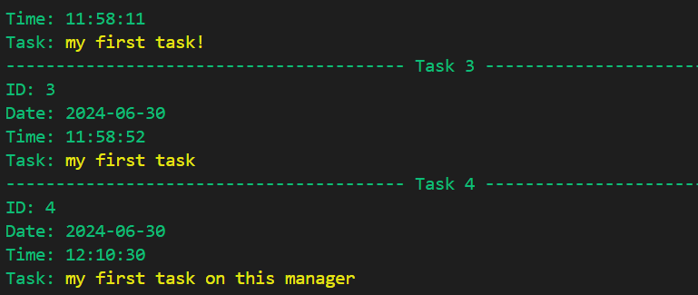

# Developer's Task Manager

   

   [Preview,I am responsive, outside site](http://www.responsinator.com/?url=https%3A%2F%2Ftask-managers-62d065a6049c.herokuapp.com%2F)

   [View Live App Here](https://task-managers-62d065a6049c.herokuapp.com/)

# Table Of Contents

- [Developer's Task Manager](#developers-task-manager)
- [Table Of Contents](#table-of-contents)
- [Introduction](#introduction)
- [User Experience](#user-experience)
- [Site \& User Goals](#site--user-goals)
  - [Site Goals](#site-goals)
  - [User Goals](#user-goals)
- [User Stories](#user-stories)
  - [1. Adding a Task](#1-adding-a-task)
  - [2. Modifying a Task](#2-modifying-a-task)
  - [3. Deleting a Task](#3-deleting-a-task)
  - [4. Viewing All Tasks](#4-viewing-all-tasks)
  - [5. Persistent Storage](#5-persistent-storage)
  - [6. Real-Time Feedback](#6-real-time-feedback)
  - [7. Secure Data Handling](#7-secure-data-handling)
- [Development Planes](#development-planes)
- [Strategy](#strategy)
- [Scope](#scope)
- [Functional Specifications](#functional-specifications)
- [Structure](#structure)
- [Skeleton](#skeleton)
- [Flow Logic](#flow-logic)
- [Flow Logic Diagram](#flow-logic-diagram)
- [Surface and Features](#surface-and-features)
- [Technologies Used](#technologies-used)
- [Bugs \& Issues](#bugs--issues)
- [Libraries Imported](#libraries-imported)
- [Testing](#testing)
- [Manual Testing](#manual-testing)
  - [1. Adding a Task Test](#1-adding-a-task-test)
  - [2. Modifying a Task Test](#2-modifying-a-task-test)
  - [3. Deleting a Task Test](#3-deleting-a-task-test)
  - [4. Showing All Tasks Test](#4-showing-all-tasks-test)
  - [5. Persistent StorageTest](#5-persistent-storagetest)
- [Automated Testing](#automated-testing)
- [Pep-8 Testing](#pep-8-testing)
- [Credits & Acknowledgements](#credits--acknowledgements)

   ***

# Introduction

   The Developers' Task Manager is a Python-based application designed to help developers organize and manage their tasks efficiently. It provides a simple interface to add, modify,show and delete tasks, ensuring that developers can focus on what they do best: coding.
   ***

# User Experience

## Site & User Goals

### Site Goals

- Provide an Intuitive User Interface: Ensure that the interface is user-friendly and easy to navigate for developers of all skill levels.
- Facilitate Task Management: Allow users to easily add, modify, delete, and view tasks.
- Ensure Persistent Storage: Store tasks in a reliable and easily accessible manner.
- Provide Real-Time Feedback: Offer immediate confirmation or error messages to users for actions performed.
- Support Cross-Platform Use: Make the application accessible on various operating systems.

### User Goals

- Efficient Task Management: Quickly add,read, modify,remove tasks.
- View Task History: Access a log of all tasks to track progress and changes.
- Receive Confirmation Messages: Get immediate feedback when a task is added, modified, or deleted.
- Secure Data Handling: Ensure tasks are stored securely and are not lost.

## User Stories

### 1. Adding a Task

   As a developer, I want to add a new task with a description so that I can keep track of my upcoming work.

   **Acceptance Criteria:**

   A. The system should prompt the user to enter a task description.  
   B. The task should be assigned a unique ID, current date, and time.  
   C. The task should be saved and visible in the task list.  
   D. A confirmation message should be displayed.  

### 2. Modifying a Task

   As a developer, I want to modify the description of an existing task so that I can update the task details if they change.

   **Acceptance Criteria:**

   A. The system should prompt the user to enter the task ID they wish to modify.  
   B. The system should allow the user to enter a new description.  
   C. The task should be updated with the new description.  
   D. A confirmation message should be displayed if the modification is successful.  

### 3. Deleting a Task

   As a developer, I want to delete a task by its ID so that I can remove tasks that are no longer needed.

   **Acceptance Criteria:**

   A. The system should prompt the user to enter the task ID they wish to delete.  
   B. The task should be removed from the list.  
   C. A confirmation message should be displayed if the deletion is successful.  
   D. An error message should be displayed if the task ID does not exist.  

### 4. Viewing All Tasks

   As a developer, I want to view a list of all tasks so that I can see what work needs to be done and track my progress.

   **Acceptance Criteria:**

   A. The system should display all tasks with their ID, date, time, and description.  
   B. The tasks should be displayed in a readable format.  
   C. The list should be up-to-date with all added, modified, or deleted tasks.  

### 5. Persistent Storage

   As a developer, I want to have my tasks saved in a file on my desktop so that I can access them later even if the program is closed.

   **Acceptance Criteria:**

   A. The tasks should be saved in a file on the user's desktop.  
   B. The file should be updated with every add, modify, or delete action.  
   C. The system should load tasks from the file when the program starts.  

### 6. Real-Time Feedback

   As a developer, I want to receive immediate feedback on my actions so that I know whether my task was successfully added, modified, or deleted.

   **Acceptance Criteria:**

   A. The system should display a confirmation message after a task is added, modified, or deleted.  
   B. Error messages should be displayed if an action fails (e.g., invalid task ID).  
   C. Feedback messages should be clear and concise.  

### 7. Secure Data Handling

   As a developer, I want to ensure my tasks are securely stored and not lost so that I can trust the task manager with my data.

   **Acceptance Criteria:**

   A. Tasks should not be lost even if the program is closed or restarted.  
   B. The log file should be saved in a reliable and persistent manner.

# Development Planes

## Strategy

   The inception behind the Developers Task Manager was to develop an efficient, user-friendly task management tool specifically for developers. This tool leverages a console-based interface to align with the frequent user's typical workflow and preferences, aiming to provide a seamless and engaging experience for managing tasks.

   The application *needs* to enable the **User** to:

   1. Confidently progress through the app and have a full understanding of how it works.
   2. Access the tasks in a separate file.
   3. Enjoy using the app over the console, which is their usual framework.

   The application *needs* to enable the **Client** to:

   1. Develop a task management tool by creating a custom console application that logs tasks.
   2. Provide a functional and intuitive user interface within the console environment.
   3. Ensure the application is highly accessible in terms of user input and output.

## Scope

   This module provides functionality for managing tasks for developers. It allows users to add, modify, delete, and list tasks. Each task includes an ID, date, time, and description. Tasks are stored in a log file on the user's desktop, providing easy access and persistent storage.

## Functional Specifications

- This module provides functionality for managing tasks for developers.
- It allows users to add, modify, delete, and list tasks.
- Each task includes an ID, date, time, and description.
- Tasks are stored in a log file on the user's desktop, providing easy access and persistent storage.

# Structure

   Due to the circumstances around deployment, the task manager will be organized on a single page, with a terminal acting as the basis for user and application interaction. Consequently, the text-based content will act as the main form of user interface design and interaction for the user. This will be discussed further down the README document.

# Skeleton

   The following outlines the skeleton of the "Developers Task Manager" program, detailing the primary components and their interactions:

- tasks: A list to store all task dictionaries. Each task includes an ID, date, time, and description.
- separator: A string used to separate tasks visually in the log file.
- file_name: The name of the log file where tasks are stored.
- LOG_FILE_NAME: The environment variable for the log file name, defaulting to file_name.
- full_path: The full path to the log file, determined based on the environment (local or cloud).
- input_handler: A function to handle and validate user inputs.
- clear_screen: A function to clear the terminal screen.
- show_tasks: A function to display all tasks in the terminal.
- load_tasks: A function to load tasks from the log file into the tasks list.
- save_tasks: A function to save tasks from the tasks list to the log file.
- add_task: A function to add a new task to the tasks list and save it to the log file.
- delete_task: A function to delete a task from the tasks list based on its ID.
- modify_task: A function to modify the description of an existing task based on its ID.
- main: The main function that handles user interaction and manages the program's workflow.

   

   

## Flow Logic

   The flow logic diagram below illustrates the interactions and processes within the "Developers Task Manager" program.

   1. Start: The user launches the program.
   2. Load Tasks: The program loads existing tasks from the log file.
   3. Main Menu: The user is presented with a menu to choose an action.

- Add Task:
- Input task description.
- Task added to list and saved to log file.
- Confirmation message displayed.
- Return to Main Menu.

- Modify Task:
- Input task ID and new description.
- Task is modified and saved to log file.
- Confirmation message displayed.
- Return to Main Menu.

- Show Tasks:
- Display all tasks with details.
- Return to Main Menu.

- Delete Task:
- Input task ID to delete.
- Task is deleted from the list and saved to log file.
- Confirmation message displayed.
- Return to Main Menu.

- Exit:
- Display exit message.
- End program.

   4. Exit: The user exits the program.

## Flow Logic Diagram

   

   [Back to Top](#developers-task-manager)

# Surface and Features

   The "Developers Task Manager" operates entirely within a terminal interface, offering a straightforward and text-based user experience. Below is a description of the main screens and interactions within the program.

   Main Menu
   Upon starting the program, users are greeted with the main menu, which displays the available actions:

   

   Adding a Task
   When the user selects the option to add a task, they are prompted to enter a task description:

   

   Modifying a Task
   When the user selects the option to modify a task, they are prompted to enter the task ID and the new description:

   

   Showing Tasks
   When the user selects the option to show tasks, all tasks are displayed with their details:

   

   Deleting a Task
   When the user selects the option to delete a task, they are prompted to enter the task ID to delete:

   

   Exiting the Program
   When the user selects the option to exit, a farewell message is displayed, and the program terminates:

   

   ***

# Technologies Used

   These technologies work together to provide a robust and user-friendly task management application for developers:

- Python
- PEP8
- Lighthouse
- Colorama
- OS Module
- Pathlib Module
- Time Module
- Terminal/Command Line Interface

   ***

# Bugs & Issues

   During the development of the "Developers Task Manager" project, the following bugs and issues were encountered and resolved:

   1. Incorrect Task ID Handling:

- Issue: Task IDs were not handled properly when tasks were deleted or modified. This led to incorrect task IDs being displayed or referenced.
- Solution: Ensured that task IDs are consistently managed and updated when tasks are added, modified, or deleted. Used list indexing and string conversion to handle task IDs correctly.

   2. File Path Issues:

- Issue: The application faced issues in determining the correct file path for storing the task log file, especially when deployed in different environments (local vs. cloud).
- Solution: Used the pathlib module to handle file paths in an object-oriented way and ensured compatibility across different operating systems. Added checks to determine the environment (local or cloud) and set the file path accordingly.

   3. User Input Validation:

- Issue: There were issues with user input validation, such as accepting empty inputs or invalid task IDs.
- Solution: Implemented the input_handler function to handle and validate user inputs for different data types. Added checks to ensure inputs are not empty and fall within acceptable ranges.

   4. Task Display Formatting:

- Issue: Tasks were not displayed in a readable and organized format, making it difficult for users to read task details.
- Solution: Improved the show_tasks function to format task display using colored text (with the colorama library) and consistent separators. This enhanced readability and provided a better user experience.

   5. Error Handling:

- Issue: The application lacked proper error handling, leading to crashes or undefined behavior when unexpected inputs or conditions occurred.
- Solution: Added try-except blocks to handle exceptions gracefully and provide meaningful error messages to the user. Ensured that the application continues to run smoothly even when errors occur.

   6. Persistent Storage Reliability:

- Issue: Tasks were sometimes not saved or loaded correctly, leading to data loss or inconsistency.
- Solution: Enhanced the save_tasks and load_tasks functions to ensure tasks are reliably saved to and loaded from the log file. Added checks to verify file existence and integrity.

   7. Cross-Platform Compatibility:

- Issue: The application faced issues with terminal commands and file paths that differed between operating systems (Windows, macOS, Linux).
- Solution: Used the os and pathlib modules to handle system-specific operations in a cross-platform manner. Ensured that terminal commands for clearing the screen and file path handling work correctly on all supported platforms.

   By addressing these bugs and issues, the "Developers Task Manager" project was improved to provide a reliable, user-friendly, and cross-platform task management solution for developers.

# Libraries Imported

- ## os

   Standard Python library used for interacting with the operating system.
   Utilized to determine the path to the user's desktop and to check if the environment is local or cloud-based.

- ## time

   Standard Python library used for time-related operations.
   Functions used: sleep, strftime, localtime.

- ## pathlib

   Standard Python library for working with filesystem paths in an object-oriented way.
   Used to create and check files and directories.

- ## colorama

   External Python library used to add color to text displayed in the terminal.
   Used to enhance the user interface by coloring text and providing visual feedback.

# Testing

## Manual Testing

### 1. Adding a Task Test

- Add a new task.
   Steps:
   Run the program.
   Select the option to add a task.
   Enter a task description.
   Expected Result: The task should be added to the list and a confirmation message should be displayed.
   Result: Pass

   

### 2. Modifying a Task Test

- Modify an existing task.
   Steps:
   Run the program.
   Select the option to modify a task.
   Enter the task ID and the new description.
   Expected Result: The task should be updated with the new description and a confirmation message should be displayed.
   Result: Pass

   

### 3. Deleting a Task Test

- Delete an existing task.
   Steps:
   Run the program.
   Select the option to delete a task.
   Enter the task ID.
   Expected Result: The task should be removed from the list and a confirmation message should be displayed.
   Result: Pass

   

### 4. Showing All Tasks Test

- Display all tasks.
   Steps:
   Run the program.
   Select the option to show all tasks.
   Expected Result: All tasks should be displayed with their details.
   Result: Pass

   

### 5. Persistent StorageTest

- Ensure tasks are saved and loaded correctly.
   Steps:
   Run the program and add several tasks.
   Exit the program.
   Run the program again.
   Expected Result: All previously added tasks should be loaded and displayed correctly.
   Result: Pass

## Automated Testing

- ## For automated testing, I have been use the unittest module in Python to create unit tests for this project.The image above shows the result of a unit test that failed. This particular test was designed to verify that the show_tasks function Modify was fail. The failure indicates that the function did not produce the expected output, which means there might be an issue with how tasks are being displayed or how the output is being captured during the test

   

- ## The image above shows the result of a unit test that passed. This test was also designed to verify the basic  functions. The success of this test indicates that the functions worked correctly and produced the expected output, ensuring that all tasks were displayed as intended

   

# Pep-8 Testing

- ## This screenshot displays the failure of a PEP-8 compliance test, indicating that the code did not adhere to PEP-8 standards

   

- ## This screenshot displays the successful passing of a PEP-8 compliance test, indicating that the code adheres to PEP-8 standards

   

# Deployment Configuration for Developers Task Manager

   The project was created using the Code Institute Python template provided and was deployed through Heroku.

### 1. Login / Sign Up to Heroku

Go to [Heroku](https://www.heroku.com/) and log in or sign up.

### 2. Create a New App

- From your Heroku dashboard, click on “New” > “Create New App”.
- Name your app uniquely and choose the region closest to you.

### 3. Config Vars Setup

- Navigate to the settings tab and reveal config vars.
- Add any necessary config vars (e.g., `TASKS_LOG_PATH` if you are using a custom path).

### 4. Buildpacks

- Add Python first, then Node.js as buildpacks. This ensures the correct environment is set up.

### 5. Deployment via GitHub

- Go to the deploy tab, select GitHub as the deployment method, and connect your GitHub account.
- Find your repository and connect it to Heroku.

### 6. Automatic Deployment

- Choose the branch you want to deploy (e.g., main).
- Enable automatic deploys to automatically update the Heroku app with new commits to the selected branch.

### 7. Finalize Deployment

- Heroku will build and deploy your application. Once done, you will receive a confirmation message with a link to your live application.

   

  

# Credits & Acknowledgements

### A huge thank you to my mentor Juliia Conovalova and my cohort facilitator Laura_ci and my Lovely Wife
